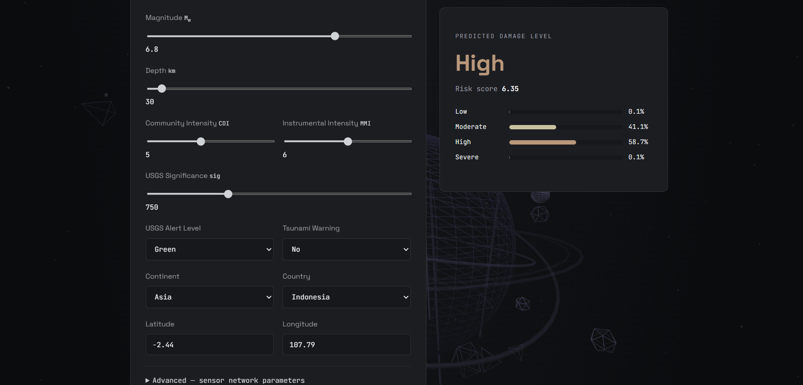
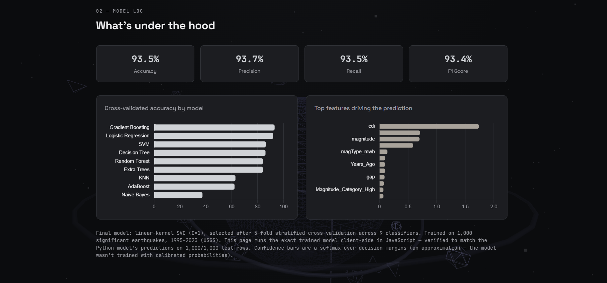

#  Earthquake Damage Prediction using Machine Learning

<div align="center">
  


###  Predict Earthquake Damage Severity with Machine Learning

**An end-to-end Machine Learning project covering Data Cleaning, EDA, Feature Engineering, Model Training, Hyperparameter Tuning, Evaluation, and Deployment using Streamlit.**

</div>

---

#  Project Overview

Earthquakes are among the most destructive natural disasters, often causing extensive damage to infrastructure and human life. Early estimation of the expected damage level helps governments, emergency responders, and disaster management agencies allocate resources more effectively.

This project leverages Machine Learning to predict the expected damage severity of an earthquake using historical earthquake characteristics such as magnitude, depth, intensity, tsunami information, significance, and engineered risk features.

The project demonstrates the complete Machine Learning lifecycle—from raw data preprocessing to deployment through an interactive web application.

---

#  Objectives

- Build an end-to-end Machine Learning pipeline
- Perform extensive Exploratory Data Analysis (EDA)
- Engineer meaningful features
- Compare multiple Machine Learning algorithms
- Optimize models using Hyperparameter Tuning
- Deploy the best model using Interactive HTML Website
- Create a professional, production-style ML project

---

#  Features

✔ Data Cleaning

✔ Missing Value Handling

✔ Duplicate Removal

✔ Exploratory Data Analysis (EDA)

✔ Feature Engineering

✔ Feature Scaling

✔ Categorical Encoding

✔ Multiple Machine Learning Algorithms

✔ Cross Validation

✔ Hyperparameter Tuning

✔ Feature Importance Analysis

✔ Model Evaluation

✔Interactive HTML Website

✔ Interactive Dashboard

✔ Download Predictions

✔ GitHub Ready Project Structure

---

#  Project Structure

```text
Earthquake-Damage-Prediction/

│
├── data/
│   ├── earthquake_1995-2023.csv
│   ├── earthquake_cleaned.csv
│   ├── processed_dataset.csv
│   └── model_results.csv
│
├── models/
│   ├── final_earthquake_model.pkl
│   ├── tuned_model.pkl
│   ├── preprocessor.pkl
│   └── label_encoder.pkl
│
├── notebooks/
│   ├── 01_Data_Cleaning_EDA.ipynb
│   ├── 02_Feature_Engineering.ipynb
│   ├── 03_Model_Building.ipynb
│   ├── 04_Model_Comparison_Hyperparameter_Tuning.ipynb
│   └── 05_Model_Evaluation_Deployment.ipynb
│
├── Interactive HTML Website
├── requirements.txt
├── README.md
└── images/
```

---

#  Machine Learning Workflow

```text
Historical Earthquake Data
              │
              ▼
      Data Cleaning
              │
              ▼
 Exploratory Data Analysis
              │
              ▼
   Feature Engineering
              │
              ▼
 Encoding & Scaling
              │
              ▼
 Train-Test Split
              │
              ▼
 Multiple ML Models
              │
              ▼
 Hyperparameter Tuning
              │
              ▼
 Best Model Selection
              │
              ▼
   Model Evaluation
              │
              ▼
  Interactive HTML Website
```

---

#  Dataset Features

The project uses earthquake-related attributes such as:

- Magnitude
- Depth
- CDI (Community Determined Intensity)
- MMI (Modified Mercalli Intensity)
- Significance Score
- Tsunami Indicator
- Alert Level
- Latitude
- Longitude
- Country
- Continent
- Date & Time

### Engineered Features

- Magnitude Category
- Depth Category
- Energy Index
- Risk Score
- High Alert Flag
- Tsunami Flag
- Years Since Event

---

#  Machine Learning Models

The project compares multiple classification algorithms:

| Model | Status |
|--------|--------|
| Logistic Regression | ✅ |
| Decision Tree | ✅ |
| Random Forest | ✅ |
| Gradient Boosting | ✅ |
| Extra Trees | ✅ |
| AdaBoost | ✅ |
| K-Nearest Neighbors | ✅ |
| Support Vector Machine | ✅ |
| Naive Bayes | ✅ |

---

#  Model Evaluation

The project evaluates models using:

- Accuracy
- Precision
- Recall
- F1 Score
- Confusion Matrix
- Cross Validation
- Feature Importance
- Learning Curve
- Validation Curve

---

#  Application Screenshots

###  Home Page


---

###  Prediction Page



---

###  Model Information



---

#  Data Visualizations

### Earthquakes Per Year


### Damage Level Count


### Magnitude Distribution


### Magnitude vs Depth


### Correlation Heatmap


---

#  Model Comparison

### Accuracy of Machine Learning Models


### Cross Validation Accuracy


### F1 Score


---

#  Model Evaluation

### Confusion Matrix


---

#  Feature Analysis

### Feature Importance


---

# ⚙️ Hyperparameter Tuning

### Learning Curve


### Validation Curve

.png)
---

#  Installation

### Clone the Repository

```bash
git clone https://github.com/CODE-BUG25/Earthquake-Damage-Prediction.git
```

### Navigate to the Project Folder

```bash
cd Earthquake-Damage-Prediction
```

### Install Required Libraries

```bash
pip install -r requirements.txt
```

### Launch the Website

Open the `website/index.html` file in your preferred web browser.

---

#  Required Libraries

```
Python
NumPy
Pandas
Matplotlib
Seaborn
Plotly
Scikit-Learn
Joblib
Pickle
```

---

#  Future Improvements

- Integrate real-world damage labels
- Add XGBoost, LightGBM & CatBoost
- Explain predictions using SHAP
- Real-time earthquake data integration
- REST API deployment
- Docker support
- Cloud deployment (AWS/Azure/GCP)

---

#  Learning Outcomes

This project demonstrates practical experience with:

- Data Preprocessing
- Feature Engineering
- Exploratory Data Analysis
- Machine Learning
- Hyperparameter Optimization
- Model Evaluation
- Model Deployment
- Interactive Dashboard Development

---

#  License

This project is licensed under the **MIT License**.

You are free to use, modify, and distribute this project under the terms of the MIT License.

See the **LICENSE** file for more details.

---

#  Author

## Sourabh Verma

**B.Tech Computer Science Student**

Passionate about:

- Artificial Intelligence
- Machine Learning
- Data Science
- Deep Learning
- Open Source
- Space Technology

### Connect with me

GitHub

https://github.com/CODE-BUG25

LinkedIn

https://www.linkedin.com/in/sourabh-verma-0b480036b/

Email

sverma25072006@gmail.com

---

<div align="center">

### ⭐ If you found this project useful, consider giving it a Star!


<div align="center">

## 🚀 Happy Coding!

### ⭐ Star • 🍴 Fork • 🛠️ Contribute • 📢 Share

**Made with ❤️ by Sourabh Verma**

</div>
```
